<div align="center">
  

  # 📅Leaveapp

  *Manage employee leave requests with role-based workflows.*

      
</div>

---

> [!NOTE]
> Not a production application.
> It was built to demonstrate layered architecture, role-based access control, leave workflow management, and unit testing in ASP.NET Core MVC.

**LeaveManagementSystem** is a web application for managing employee leave requests in a company. Employees submit leave requests, managers approve or decline them, and administrators control the entire organizational structure — departments, leave types, periods, and public holidays.

---

## 📖 Table of Contents

- [🎯 Why This Project Matters](#-why-this-project-matters)
- [📋 Overview](#-overview)
- [📸 Screenshots](#-screenshots)
- [🏗️ Architecture](#️-architecture)
- [🛠️ Tech Stack](#️-tech-stack)
- [🎨 UI Layouts](#-ui-layouts)
- [🔐 Roles and Permissions](#-roles-and-permissions)
- [⚡ Features](#-features)
- [🔄 How It Works — End to End](#-how-it-works--end-to-end)
- [📅 Leave Allocation Logic](#-leave-allocation-logic)
- [🔑 Identity and Authentication](#-identity-and-authentication)
- [📁 Project Structure](#-project-structure)
- [🗄️ Database Schema](#️-database-schema)
- [🚀 Running the Project](#-running-the-project)
- [🧪 Testing](#-testing)


---

## 🎯 Why This Project Matters

This is not a simple CRUD application. It demonstrates the ability to design and implement a real business workflow end-to-end:

- 🏗️ **Layered architecture** with clear separation of concerns — Web, Application, Data, Common layers each with a single responsibility
- 🧠 **Non-trivial business logic** — leave validation chains (overlap check, working days check, allocation balance check), proportional accrual calculation, role-filtered employee visibility
- 🔐 **Role-based access control** with 4 roles and granular permission guards on every controller action
- 🔑 **ASP.NET Core Identity** scaffolded and extended with custom fields and registration logic
- 🧪 **Unit testing** with NUnit + Moq covering all service methods, including edge cases and validation rules
- 🛠️ **Production-grade tooling** — AutoMapper for clean ViewModel mapping, Serilog for structured logging, IMemoryCache for performance, SweetAlert2 for UX

---

## 📋 Overview

LeaveManagementSystem solves the problem of manual leave tracking in organizations. Instead of spreadsheets or paper-based processes, the system provides a structured workflow:

- 👤 Employees see their leave balance and submit requests
- 👔 Managers review and approve or decline requests for their team
- 🏢 General Managers oversee their assigned managers
- ⚙️ Administrators manage the full organizational setup

---

## 📸 Screenshots

### 🌐 Public pages

| Landing page | Register |
|---|---|
| 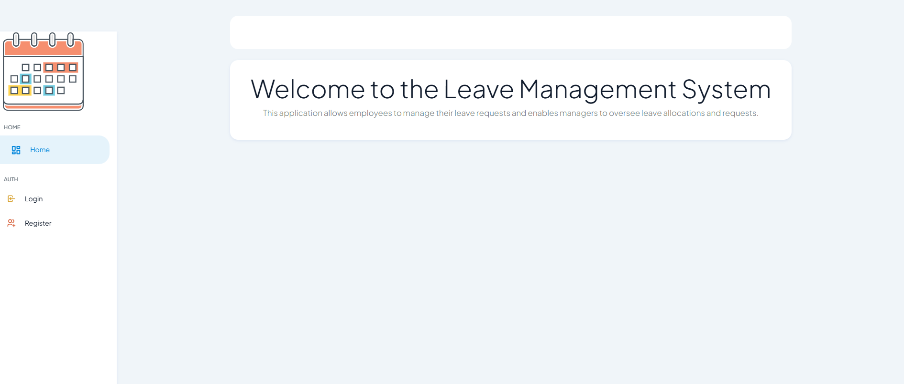 | 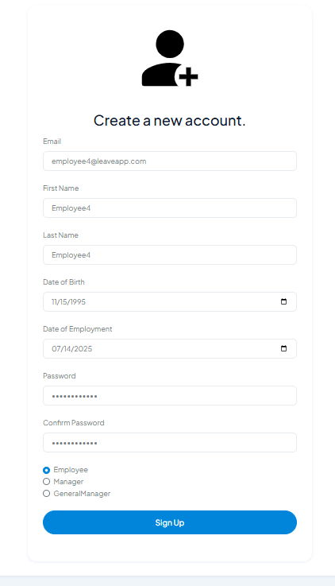 |

> **Landing page** uses `_AdminLayout` — sidebar visible with Home, Login, and Register for unauthenticated users.
> **Register page** uses `_Layout` — extended form with First Name, Last Name, Date of Birth, Date of Employment, and role selection (Employee / Manager / GeneralManager).

### ⚙️ Admin views

| Departments list | Edit department |
|---|---|
| 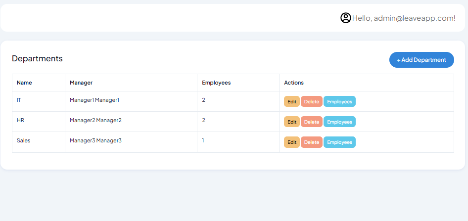 | 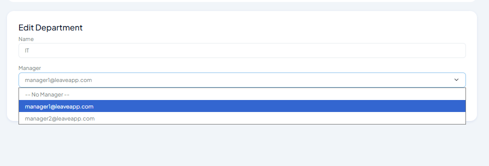 |

> Departments list shows Name, Manager, and employee count. Edit department allows reassigning the manager via dropdown.

| Manage employees in department | Add employee to department |
|---|---|
| 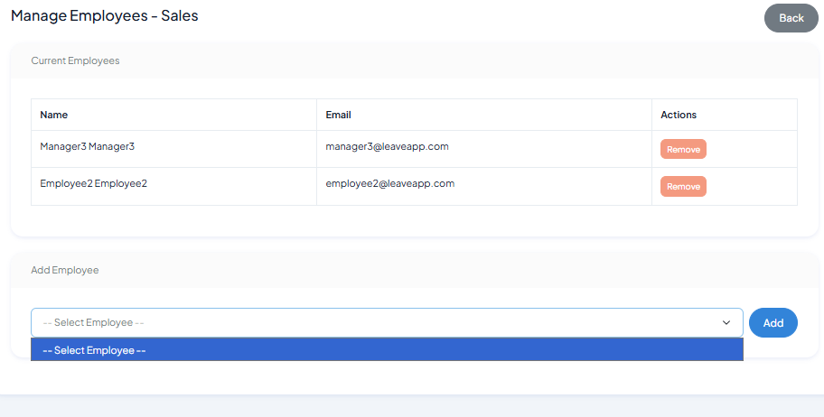 | 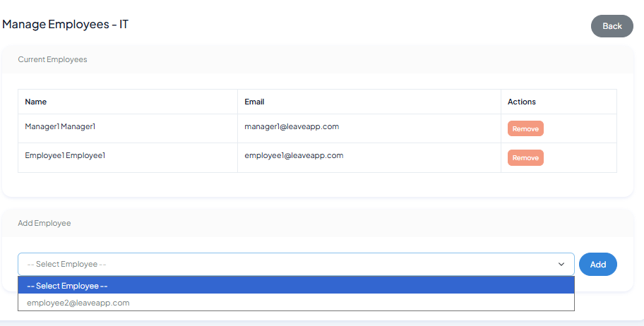 |

> Admin can add or remove employees from a department. The dropdown shows only unassigned employees.

| Leave types | Periods |
|---|---|
| 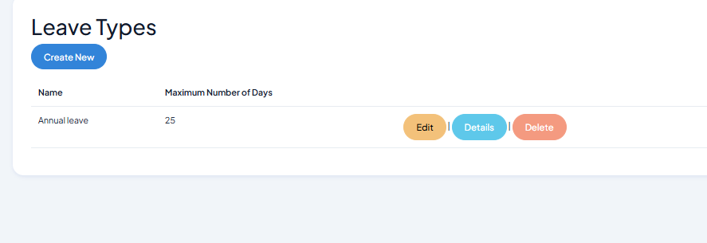 | 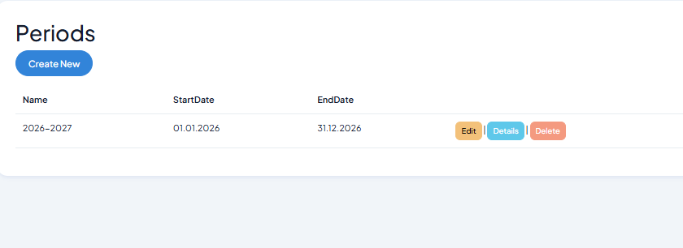 |

| Public holidays | All employees |
|---|---|
| 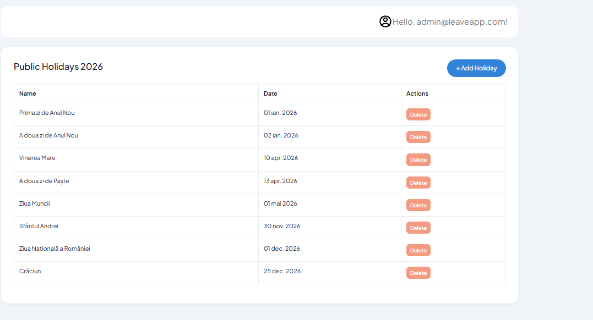 | 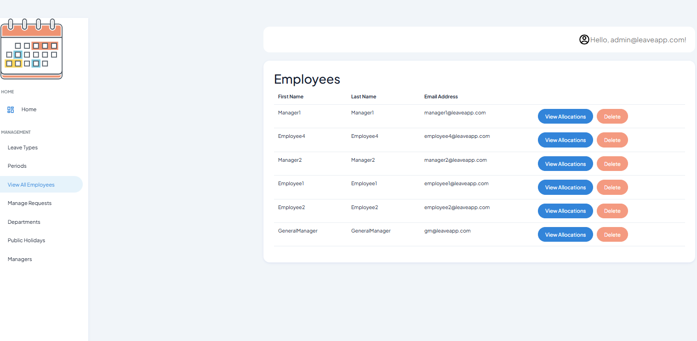 |

> Public holidays are configured per year and excluded from working day calculations. The Employees page shows all users across all roles with View Allocations and Delete actions.

| Managers & General Managers |
|---|
| 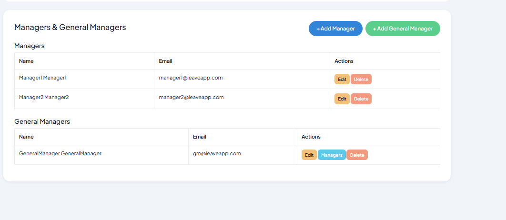 |

> Admin sees Managers and General Managers in a single page. Each GM has a Managers button to manage the GM↔Manager hierarchy.

### 👤 Employee views

| Leave allocation | View allocations detail |
|---|---|
| 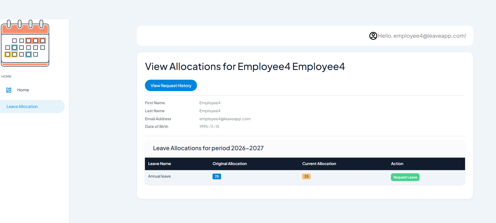 | 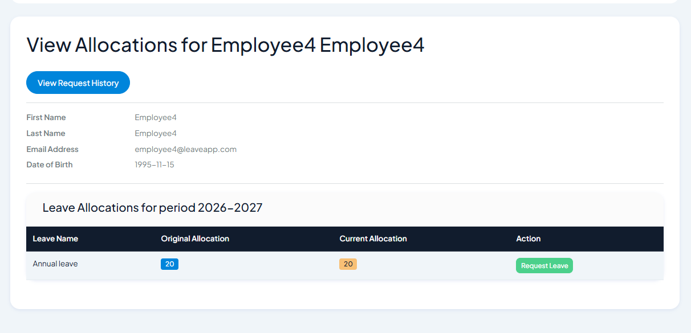 |

> Employee sees their leave balance per leave type and period — Original Allocation vs Current Allocation remaining. Request Leave button navigates directly to the create form.

| Create leave request | Leave requests overview |
|---|---|
| 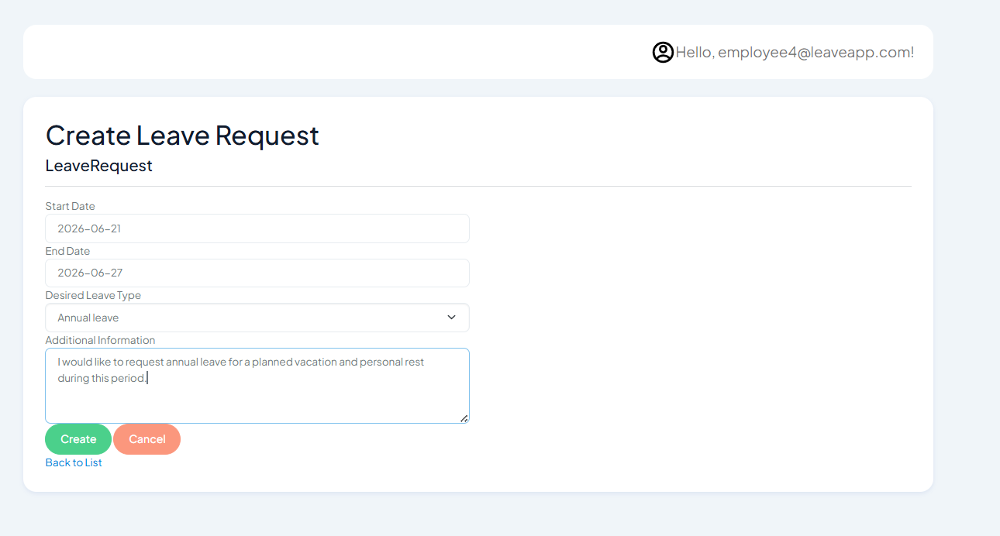 | 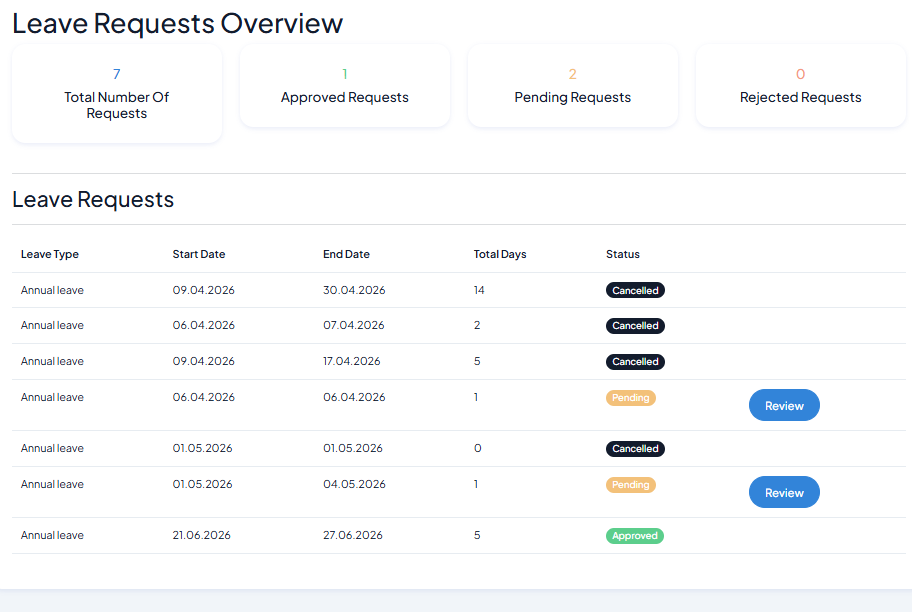 |

> Create form takes Start Date, End Date, Leave Type, and optional Additional Information. The overview shows all requests with status badges (Pending, Approved, Cancelled) and summary stats at the top.

### 👔 Manager views

| Team (employees list) | Team leave requests |
|---|---|
| 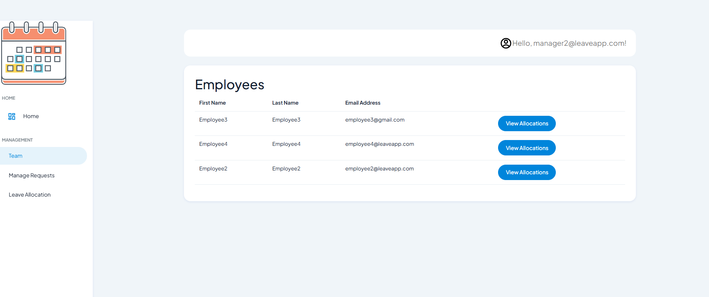 | 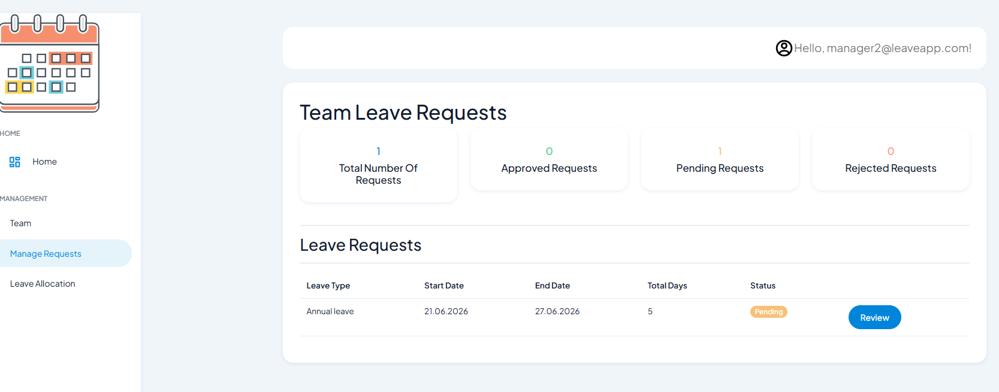 |

> Manager sees only employees from their own department. Team leave requests shows a summary (Total, Approved, Pending, Rejected) and a list with Review button for pending requests.

| Leave request review |
|---|
| 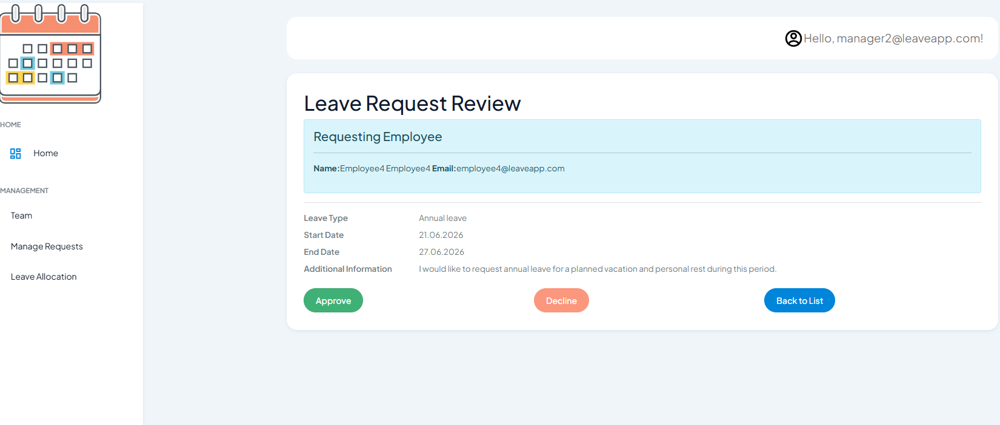 |

> Manager reviews a request with full details — employee name, leave type, dates, and comment — then approves or declines.

### 📧 Email confirmation flow

| Step 1 — confirmation email sent | Step 2 — email confirmed |
|---|---|
| 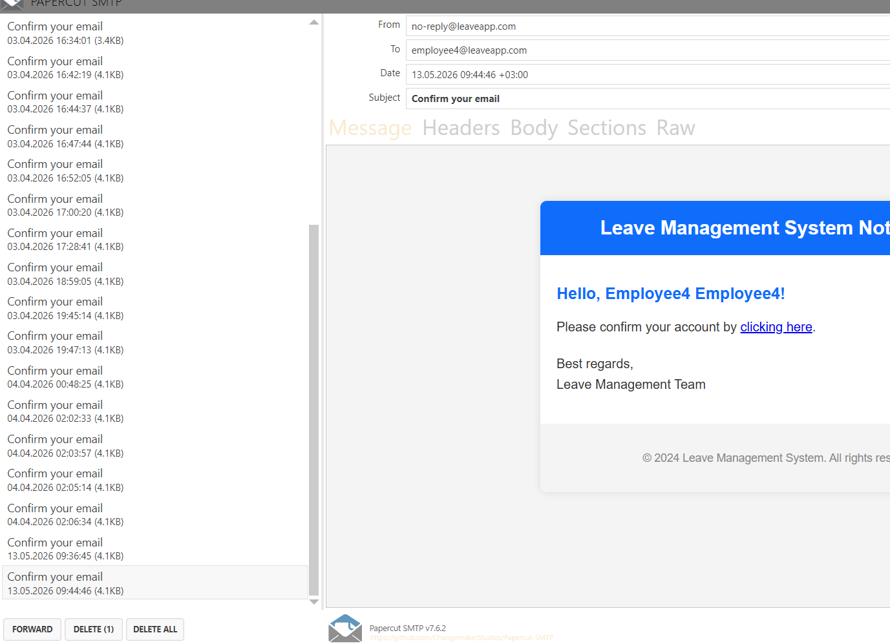 | 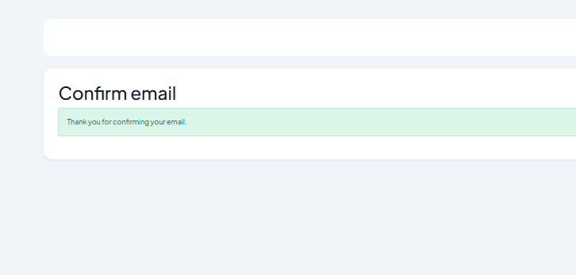 |

> New accounts require email confirmation before first login. Email is sent via SMTP (Papercut used for local dev). After clicking the confirmation link, the account is activated.

---

## 🏗️ Architecture

LeaveManagementSystem follows a **layered architecture** — each layer has a clear responsibility and depends only on the layers beneath it.

```
┌──────────────────────────────────────────────────┐
│              Presentation Layer                  │
│     LeaveManagementSystem.Web (MVC + Razor)      │
└───────────────────────┬──────────────────────────┘
                        │
┌───────────────────────▼──────────────────────────┐
│              Application Layer                   │
│  LeaveManagementSystem.Application               │
│  (Services, Interfaces, Models, AutoMapper)      │
└───────────────────────┬──────────────────────────┘
                        │
┌───────────────────────▼──────────────────────────┐
│              Data Layer                          │
│  LeaveManagementSystem.Data                      │
│  (EF Core, Entities, Migrations, DbContext)      │
└───────────────────────┬──────────────────────────┘
                        │
┌───────────────────────▼──────────────────────────┐
│              Common Layer                        │
│  LeaveManagementSystem.Common                    │
│  (Shared constants — Roles)                      │
└──────────────────────────────────────────────────┘
```

**Separation of concerns:**

- **Web** — Controllers and Razor Views. Handles HTTP requests, calls Application services, renders UI. No direct DB access.
- **Application** — All business logic. Services depend on interfaces, not on EF Core directly. AutoMapper profiles translate entities to view models.
- **Data** — EF Core entities, `ApplicationDbContext`, migrations, and EF Fluent API configurations. Extends ASP.NET Core Identity.
- **Common** — Shared static values (role name constants) used across layers without creating circular dependencies.

---

## 🛠️ Tech Stack

| Technology | Purpose |
|---|---|
| ASP.NET Core 10.0 MVC | Web framework — controllers, Razor views, routing |
| Entity Framework Core 10.0 | ORM — database access and migrations |
| ASP.NET Core Identity | User management, password hashing, role-based auth |
| AutoMapper 15 | Entity → ViewModel mapping |
| Serilog | Structured logging (console + file + Seq) |
| IMemoryCache | In-memory caching for leave types (30 min TTL) |
| SweetAlert2 | Confirmation modals (approve / decline / delete) |
| Bootstrap 5 | UI styling — public pages |
| Spike Free Bootstrap Admin (WrapPixel) | Admin dashboard layout |
| NUnit + Moq | Unit testing framework |
| SQL Server (LocalDB) | Database |

---

## 🎨 UI Layouts

The app uses **two separate layouts** with a clear architectural separation between the public entry point and the authenticated platform.

| Layout | Used for | Template |
|---|---|---|
| `_Layout.cshtml` | Public pages — Home, Login, Register | Standard Bootstrap 5 horizontal navbar |
| `_AdminLayout.cshtml` | All authenticated pages — the entire platform after login | [Spike Free Bootstrap Admin](https://wrappixel.com/templates/spike-free-bootstrap-admin/) by WrapPixel |

`_AdminLayout` is set as the default for all views via `_ViewStart.cshtml`. It features a fixed sidebar with role-based navigation: unauthenticated users see only Login and Register; after login, each role sees only the sections relevant to them (Administrator gets 7 management links, Manager gets Team and Requests, GeneralManager gets My Managers and Requests, Employee gets Leave Allocation). `_Layout` is used exclusively by the Identity pages (Login, Register) which have their own simple navbar without management links.

---

## 🔐 Roles and Permissions

The system has four roles with distinct access levels:

| Role | Description |
|---|---|
| ⚙️ **Administrator** | Full access — manages departments, leave types, periods, public holidays, managers, and employees |
| 🏢 **GeneralManager** | Sees their assigned managers and the full team leave request list |
| 👔 **Manager** | Sees employees in their department, reviews and approves/declines leave requests |
| 👤 **Employee** | Submits leave requests, views their own allocations and request history |

> [!NOTE]
> A Manager also has the Employee role — they can submit their own leave requests too.

### Permission matrix

| Action | Admin | GeneralManager | Manager | Employee |
|---|---|---|---|---|
| Manage departments | ✓ | | | |
| Manage leave types | ✓ | | | |
| Manage periods | ✓ | | | |
| Manage public holidays | ✓ | | | |
| Create managers / GMs | ✓ | | | |
| View all employees | ✓ | | | |
| Delete employees | ✓ | | | |
| View team leave requests | ✓ | ✓ | ✓ | |
| Review (approve/decline) requests | ✓ | | ✓ | |
| View own leave allocations | ✓ | ✓ | ✓ | ✓ |
| Submit leave request | | | ✓ | ✓ |
| Cancel own leave request | | | ✓ | ✓ |

---

## ⚡ Features

- 🔐 **Role-based access control** — 4 roles with separate views and permission guards on every controller action
- 🔄 **Leave request workflow** — Employee submits → Manager reviews → Approved / Declined / Cancelled
- 📅 **Leave allocation per period** — Days allocated proportionally based on date of employment and current period
- 🚫 **Overlap validation** — Cannot submit a new request that overlaps an existing pending/approved one
- 📆 **Working days validation** — Request period must contain at least one working day (excludes weekends and public holidays)
- ⚖️ **Allocation balance check** — Cannot request more days than the remaining allocation
- 🏢 **Department management** — Create departments, assign managers and employees
- 📋 **Leave types management** — Configurable leave types (Annual, Sick, etc.) with max days
- 🗓️ **Periods** — Annual periods that define the leave year boundaries
- 🎉 **Public holidays** — Configurable per year; excluded from working day calculations
- 👥 **General Manager hierarchy** — A GM can be assigned multiple managers and sees their full team
- ⚡ **Memory cache** — Leave types cached in memory for 30 minutes to reduce DB calls
- 📧 **Email confirmation** — New accounts require email confirmation before first login
- 🔔 **Confirmation modals** — SweetAlert2 dialogs before approve, decline, and delete actions
- 📝 **Structured logging** — Serilog throughout all services (info, warning, error levels)
- 🧪 **Unit tests** — NUnit + Moq test suite covering all service methods

---

## 🔄 How It Works — End to End

### 👤 Employee submits a leave request

```
Employee fills in Create Leave Request form
  - selects leave type, start date, end date, optional comment
        │
        ▼
LeaveRequestsController.Create (POST)
  - checks for overlapping requests (same employee, overlapping dates, pending/approved)
  - checks that period contains working days (not all weekends/holidays)
  - checks that requested days do not exceed remaining allocation
        │
        ▼ (if all checks pass)
LeaveRequestsService.CreateLeaveRequest()
  - maps VM to LeaveRequest entity
  - sets EmployeeId from logged-in user
  - sets status = Pending
  - saves to database
        │
        ▼
Manager sees it in ListRequests → opens Review page → Approve or Decline
  - SweetAlert2 confirmation modal before submit
  - LeaveRequestsService.ReviewLeaveRequest() updates status + sets ReviewerId
        │
        ▼
Employee sees updated status on their Index view
  - can Cancel if still Pending (Approved requests cannot be cancelled)
```

### ⚙️ Admin sets up the system

```
1. Admin creates Leave Types (e.g. Annual Leave — 21 days, Sick Leave — 10 days)
2. Admin creates a Period (e.g. 2026: 01/01/2026 → 31/12/2026)
3. Admin creates Departments (IT, HR, Finance, Sales...)
4. Admin creates Managers via Managers → Create Manager
   - Manager gets Employee + Manager roles automatically
   - Leave is allocated immediately on creation
5. Admin assigns Manager to Department
6. Employees register via the Register page
   - Employee role assigned automatically
   - Leave allocated immediately on registration
7. Admin assigns Employee to Department via Departments → Employees
8. Manager can now see their team and review requests
```

---

## 📅 Leave Allocation Logic

When a new user is created (employee or manager), `LeaveAllocationsService.AllocateLeave()` runs immediately:

```
For each LeaveType in the system:
  1. Skip if allocation already exists for this user + period + leave type
  2. Determine start date:
       start = max(employee.DateOfEmployment, period.StartDate)
  3. Calculate months remaining in period from start date
  4. accrualRate = leaveType.NumberOfDays / 12
  5. allocatedDays = ceil(accrualRate × monthsRemaining)
  6. Save LeaveAllocation { EmployeeId, LeaveTypeId, PeriodId, Days }
```

> [!IMPORTANT]
> An employee hired mid-year gets a proportionally smaller allocation — fair accrual rather than a full-year grant.

---

## 🔑 Identity and Authentication

LeaveManagementSystem uses **ASP.NET Core Identity scaffolded and extended**.

**What scaffolding means:** Instead of using the default Identity UI hidden inside a NuGet package (which you cannot modify), the Identity pages were scaffolded — meaning Visual Studio generated the actual `.cshtml` and `.cshtml.cs` files into the project under `Areas/Identity/Pages/Account/`. This makes every page fully editable.

**What was extended on top of the scaffolded base:**

- `ApplicationUser` extends `IdentityUser` with: `FirstName`, `LastName`, `DateOfBirth`, `DateOfEmployment`, `DepartmentId`
- `Register.cshtml.cs` — extended with custom fields in the input model, role selection dropdown, automatic role assignment on registration, and immediate leave allocation on account creation
- `ApplicationDbContext` extends `IdentityDbContext<ApplicationUser>` so EF Core creates all Identity tables (`AspNetUsers`, `AspNetRoles`, `AspNetUserRoles`, etc.) alongside the application tables

**Why Identity and not a custom auth system:**
Identity handles password hashing, lockout policies, token generation (for email confirmation), and role management out of the box. Building this securely from scratch would be unnecessary complexity.

---

## 📁 Project Structure

```
LeaveManagementSystem/
│
├── LeaveManagementSystem.Web/                  # MVC Web Application
│   ├── Program.cs                              # DI setup, Identity, Serilog, routing
│   ├── Controllers/
│   │   ├── LeaveAllocationController.cs        # Employee list, allocations, delete employee
│   │   ├── LeaveRequestsController.cs          # Submit, cancel, review requests
│   │   ├── LeaveTypesController.cs             # CRUD leave types (Admin)
│   │   ├── DepartmentsController.cs            # CRUD departments, assign employees (Admin)
│   │   ├── ManagersController.cs               # CRUD managers/GMs, GM↔Manager assignment (Admin)
│   │   ├── PeriodsController.cs                # CRUD periods (Admin)
│   │   ├── PublicHolidaysController.cs         # CRUD public holidays (Admin)
│   │   └── HomeController.cs                   # Landing page
│   ├── Areas/Identity/Pages/Account/
│   │   └── Register.cshtml.cs                  # Extended registration (name, DOB, role)
│   └── Views/
│       ├── LeaveAllocation/                    # Index (employee list), Details, EditAllocation
│       ├── LeaveRequests/                      # Index, Create, ListRequests, Review
│       ├── LeaveTypes/                         # Index, Create, Edit, Delete, Details
│       ├── Departments/                        # Index, Create, Edit, Delete, ManageEmployees
│       ├── Managers/                           # Index, CreateManager, CreateGeneralManager,
│       │                                       #   Edit, ManageManagers, MyManagers
│       ├── Periods/                            # Index, Create, Edit, Delete
│       ├── PublicHolidays/                     # Index, Create
│       └── Shared/                             # _Layout (public), _AdminLayout (authenticated)
│
├── LeaveManagementSystem.Application/          # Business Logic Layer
│   ├── Services/
│   │   ├── LeaveAllocations/                   # AllocateLeave, GetEmployeeAllocations, Edit
│   │   ├── LeaveRequests/                      # Create, Cancel, Review, Validate (overlap/days/balance)
│   │   ├── LeaveTypes/                         # CRUD + memory cache + name uniqueness check
│   │   ├── Departments/                        # CRUD + assign manager/employee
│   │   ├── Managers/                           # CRUD managers/GMs + GM↔Manager hierarchy
│   │   ├── Periods/                            # CRUD + GetCurrentPeriod
│   │   ├── PublicHolidays/                     # CRUD + GetWorkingDays calculation
│   │   ├── UserService.cs                      # GetLoggedInUser, GetEmployees (role-filtered)
│   │   └── Email/EmailSender.cs                # SMTP email sender (registration confirmation)
│   ├── Models/                                 # ViewModels per feature area
│   ├── MappingProfiles/                        # AutoMapper profiles
│   └── ApplicationServicesRegistration.cs      # IServiceCollection extension
│
├── LeaveManagementSystem.Data/                 # Data Layer
│   ├── ApplicationDbContext.cs                 # IdentityDbContext with all DbSets
│   ├── ApplicationUser.cs                      # IdentityUser + FirstName, LastName, DOB, DateOfEmployment, DepartmentId
│   ├── LeaveType.cs                            # Name, NumberOfDays
│   ├── LeaveAllocation.cs                      # Employee + LeaveType + Period + Days
│   ├── LeaveRequest.cs                         # Employee + LeaveType + Status + Dates + Reviewer
│   ├── LeaveRequestStatus.cs                   # Pending, Approved, Declined, Cancelled
│   ├── Department.cs                           # Name + Manager + Employees list
│   ├── Period.cs                               # Name + StartDate + EndDate
│   ├── PublicHoliday.cs                        # Name + Date + Year
│   ├── GeneralManagerManager.cs                # Junction table: GM ↔ Manager relationship
│   ├── Configurations/                         # EF Fluent API configs + seeding
│   ├── Migrations/                             # EF Core migration history
│   └── DataServicesRegistration.cs             # Registers DbContext + Identity
│
├── LeaveManagementSystem.Common/               # Shared Constants
│   └── Static/Roles.cs                         # Administrator, Manager, GeneralManager, Employee
│
└── LeaveManagementSystem.Application.Tests/    # Unit Tests (NUnit + Moq)
    ├── LeaveTypesServiceTests.cs
    ├── LeaveRequestsServiceTests.cs
    ├── LeaveAllocationServiceTests.cs
    ├── DepartmentsServiceTests.cs
    ├── ManagersServiceTests.cs
    ├── UserServiceTests.cs
    ├── PeriodsServiceTests.cs
    └── PublicHolidaysServiceTests.cs
```

---

## 🗄️ Database Schema

```
AspNetUsers (ApplicationUser)
  Id (PK), Email, UserName, FirstName, LastName,
  DateOfBirth, DateOfEmployment, DepartmentId (FK → Departments)

Departments
  Id (PK), Name, ManagerId (FK → AspNetUsers)

LeaveTypes
  Id (PK), Name, NumberOfDays

Periods
  Id (PK), Name, StartDate, EndDate

LeaveAllocations
  Id (PK), EmployeeId (FK → AspNetUsers),
  LeaveTypeId (FK → LeaveTypes), PeriodId (FK → Periods), Days

LeaveRequestStatuses
  Id (PK), Name   -- Pending | Approved | Declined | Cancelled

LeaveRequests
  Id (PK), EmployeeId (FK → AspNetUsers), ReviewerId (FK → AspNetUsers),
  LeaveTypeId (FK → LeaveTypes), LeaveRequestStatusId (FK → LeaveRequestStatuses),
  StartDate, EndDate, RequestComments

PublicHolidays
  Id (PK), Name, Date, Year

GeneralManagerManagers
  GeneralManagerId (FK → AspNetUsers), ManagerId (FK → AspNetUsers)
```

---

## 🚀 Running the Project

### Prerequisites

- .NET 10 SDK
- SQL Server (LocalDB is included with Visual Studio)
- SMTP server for email confirmation — or disable `RequireConfirmedAccount` in `Program.cs` for local dev

### Steps

**1. Clone the repository**

```bash
git clone https://github.com/DraganMonica/LeaveManagementSystem.git
cd LeaveManagementSystem
```

**2. Configure the connection string**

Edit `LeaveManagementSystem.Web/appsettings.json`:
```json
{
  "ConnectionStrings": {
    "DefaultConnection": "Server=(localdb)\\mssqllocaldb;Database=LeaveManagementDB;Trusted_Connection=True;"
  }
}
```

**3. Apply database migrations**

```bash
dotnet ef database update --project LeaveManagementSystem.Data --startup-project LeaveManagementSystem.Web
```

**4. Configure SMTP (optional)**

Edit `LeaveManagementSystem.Web/appsettings.json` with your SMTP credentials, or set `options.SignIn.RequireConfirmedAccount = false` in `Program.cs` to skip email confirmation during development.

**5. Run the application**

```bash
cd LeaveManagementSystem.Web
dotnet run
```

**6. Default admin account**

Seeded via EF migrations:
- Email: `admin@leaveapp.com`
- Password: `Admin123!`

---

## 🧪 Testing

The test project uses **NUnit** and **Moq** with an EF Core in-memory database.

```bash
cd LeaveManagementSystem.Application.Tests
dotnet test
```

Each service has its own test class covering:
- ✅ Happy path (expected behavior)
- 🔲 Edge cases (empty data, not found, boundary conditions)
- ⚠️ Validation logic (overlapping requests, working days, allocation exceeded)

Dependencies (`DbContext`, `UserManager`, `ILogger`, `IMapper`, `IMemoryCache`) are either mocked with Moq or use real in-memory implementations to keep tests fast and isolated.

---


